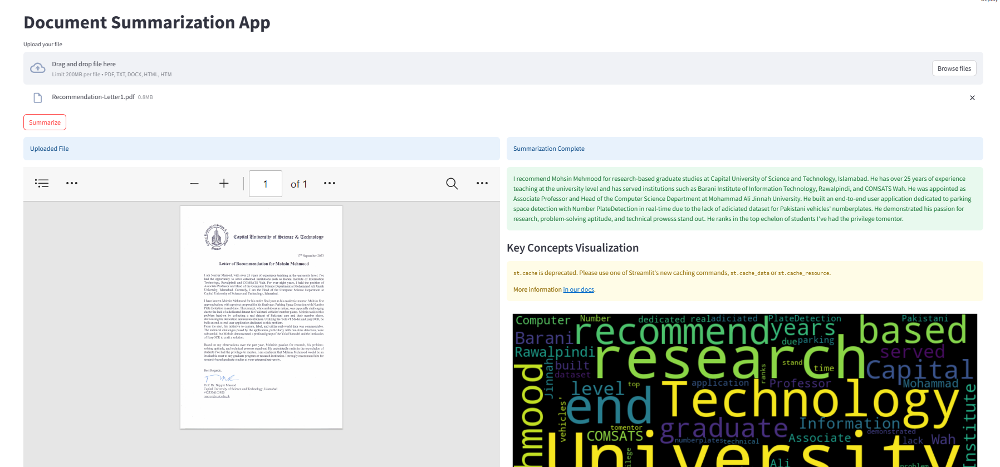

# Document-Summarizer

## Description

Document-Summarizer is a comprehensive tool designed to automatically summarize documents. It uses a combination of natural language processing and machine learning algorithms to understand and condense text, providing users with quick and accurate summaries of their documents.

## Technologies Used

- Python: Used for the core functionality of the application, such as the algorithm for summarizing the documents.
- Opensource LLM : For text summarization

## Features

- Upload documents for summarization
- View, save, and manage document summaries
- Customize summary length and detail
- Key concept visualization

## Getting Started

### Prerequisites

- Python 3.11
- Web server

### Installation

1. Clone the repository: `git clone https://github.com/mohsinmahmood12/Document-Summarizer.git`
2. Install dependencies: `pip install -r requirements.txt`
4. Start the app: `streamlit app.py`

## Usage

Visit `localhost:8501` in your web browser to start using the application.

## Contributing

Please open an issue to discuss the change you wish to make before making a change.

## License

This project is licensed under the MIT License.

## Contact

Mohsin Mehmood - mohsinmahmood675@gmail.com
